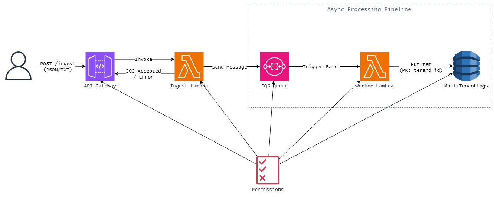

# Robust Data Processor (AWS Serverless)

This project implements a scalable, event-driven backend on AWS to ingest unstructured logs, process them asynchronously, and store them with strict multi-tenant isolation. It is designed to handle high-throughput traffic and survive worker failures.

## 1. Architecture


The system uses a **Serverless Event-Driven Architecture**:

- **Ingestion (API Gateway + Lambda)**: An HTTP API Gateway triggers the IngestAPI Lambda. This function acts as a shock absorber; it validates headers, normalizes the payload (JSON or Text), pushes the message to SQS, and immediately returns 202 Accepted.

- **Buffering (SQS)**: An SQS queue decouples ingestion from processing. This ensures that a flood of incoming requests never crashes the processing workers.

- **Processing (Worker Lambda)**: The LogWorker Lambda polls SQS. It performs the CPU-bound task (simulated sleep) and handles the database writes.

- **Storage (DynamoDB)**: A single DynamoDB table uses tenant_id as the Partition Key. This physically isolates data per tenant on the storage layer (Pool Model), satisfying the strict isolation requirement while allowing instant provisioning for new tenants.

**Data Flow**

`[Client] -> (API Gateway) -> [Ingest Lambda] -> [SQS Queue] -> [Worker Lambda] -> [DynamoDB]`

## 2. Project Structure

- `main.tf`: Complete Infrastructure as Code (IAM, API Gateway, SQS, DynamoDB, Lambdas).

- `ingest.py`: Handles HTTP requests, normalizes data, extracts Tenant IDs, and writes to SQS.

- `worker.py`: Pulls from SQS, simulates heavy processing (sleep), and writes to DynamoDB. Includes logic for Partial Batch Responses to handle individual message failures.

## 3. How to Deploy

**Prerequisites**: [Terraform](https://www.terraform.io/) installed and AWS Credentials configured (`aws configure`).

1. **Initialize Terraform**:
    ```
    terraform init
    ```

2. **Deploy Resources**:
    ```
    terraform apply -auto-approve
    ```

3. **Save the Endpoint**:

    The output `api_endpoint` is your target URL.
    **Example**: `https://xyz.execute-api.us-west-1.amazonaws.com/ingest`

4. **Evaluator/Grader Access (Required)**

    A dedicated IAM User with Read-Only access to the DynamoDB table is generated for evaluation purposes.

    **Step 1: Retrieve Credentials**
    Run the following commands to reveal the sensitive keys:
    ```
    terraform output -raw evaluator_access_key
    terraform output -raw evaluator_secret_key
    ```

    **Step 2: Verify Access (AWS CLI)**
    Configure a profile and test connectivity:
    ```
    aws configure --profile evaluator
    # Enter the keys retrieved above. Region: us-east-1
    
    # Test Read (Should Succeed)
    aws dynamodb scan --table-name MultiTenantLogs --profile evaluator

    # Test Query (Fetch specific tenant data - Efficient)
    aws dynamodb query \
        --table-name MultiTenantLogs \
        --key-condition-expression "tenant_id = :tid" \
        --expression-attribute-values '{":tid":{"S":"acme"}}' \
        --profile evaluator
    ```

5. **Testing & Chaos Simulation**

    You can test the system using curl.

    **Scenario A: Structured Data (JSON)**
    ```
    curl -X POST "YOUR_API_ENDPOINT" \
    -H "Content-Type: application/json" \
    -d '{"tenant_id": "acme", "log_id": "101", "text": "User login event"}'
    ```

    **Scenario B: Unstructured Data (Text)**
    ```
    curl -X POST "YOUR_API_ENDPOINT" \
    -H "Content-Type: text/plain" \
    -H "X-Tenant-ID: beta_inc" \
    -d "This is a raw log file dump that will take some time to process."
    ```

    **Strategy: Handling "The Flood" & Crashes**

    1. **Async Decoupling**: The API never waits for the worker. It returns `202` as soon as the message is in SQS.

    2. **Resilient Retries (Partial Failures)**: The system uses SQS Partial Batch Responses. If a worker processes a batch of 5 messages and 1 fails (e.g., database timeout), the worker reports only that specific item ID as failed. SQS will retry that single message later, while the 4 successful messages are considered complete. This prevents "poison pill" messages from blocking the entire pipeline.

    3. **Concurrency**: AWS Lambda automatically scales the number of worker instances based on the queue depth to handle the load.

## 6. Cleanup

To remove all resources and stop billing:
```
terraform destroy -auto-approve
```
